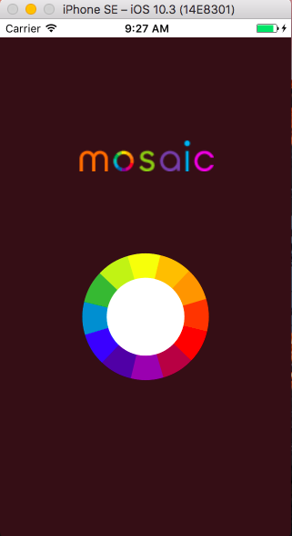
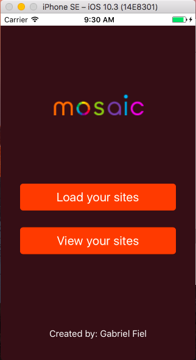
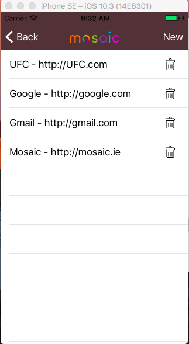
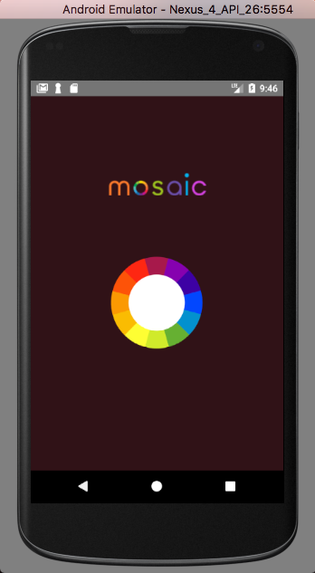
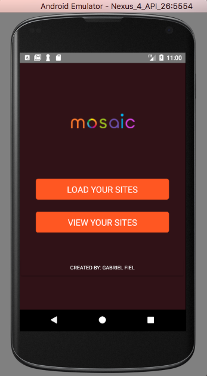
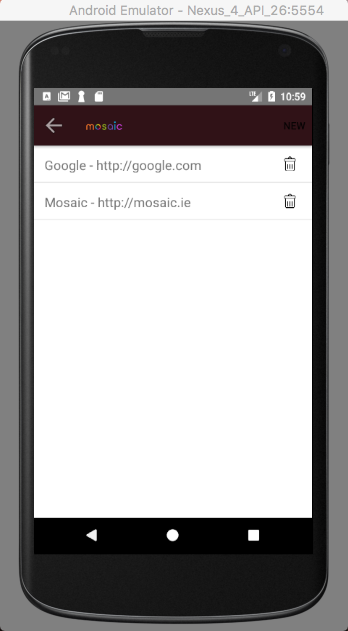
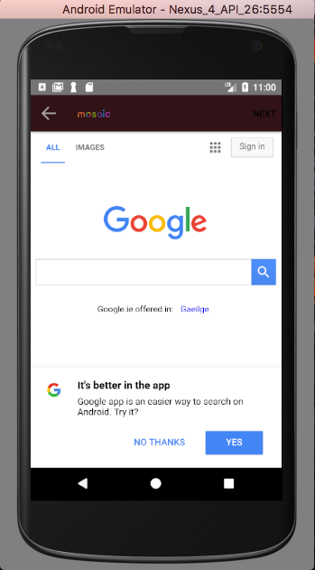

# Mosaic Wheel

Mosaic Wheel is a NativeScript-built iOS and Android app for managing your favorites websites.

<!-- * [Download](#download) -->
* [Screenshots](#screenshots)
* [Development](#development)
    * [Linting](#linting)
    * [Unit testing](#unit-testing)


<h2 id="screenshots">Screenshots</h2>











<h2 id="development">Development</h2>

This app is built with the NativeScript CLI. Once you have the [CLI installed](https://docs.nativescript.org/start/quick-setup), start by cloning the repo:

```
$ git clone https://github.com/gpfiel/Mosaic-Wheel.git
$ cd mosaic-wheel
```

From there you can use the `run` command to run Mosaic Wheel on iOS:

```
$ tns run ios
```

And the same command to run Mosaic Wheel on Android:

```
$ tns run android
```

<h3 id="linting">Linting</h3>

Mosaic Wheel uses [tslint](https://www.npmjs.com/package/tslint) + [codelyzer](https://github.com/mgechev/codelyzer) rules to ensure the code follows the [angular style guide](https://angular.io/docs/ts/latest/guide/style-guide.html).

You can run the linter with the `tslint` npm script:
```
$ npm run tslint
```

<h3 id="unit-testing">Unit Testing</h3>

Mosaic Wheel uses NativeScript’s [integrated unit test runner](http://docs.nativescript.org/core-concepts/testing) with [Jasmine](http://jasmine.github.io/). To run the tests for yourself use the `tns test` command:

```
$ tns test ios --emulator
```

```
$ tns test android --emulator
```

For more information on unit testing NativeScript apps, refer to the [NativeScript docs on the topic](http://docs.nativescript.org/core-concepts/testing).
